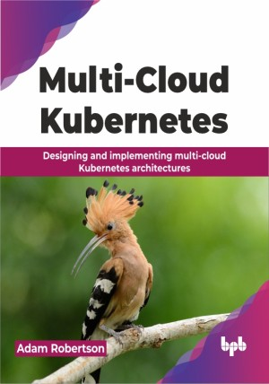

# Multi-Cloud Kubernetes

Deploy and manage Kubernetes like a pro on all the public clouds!

This is the repository for [Multi-Cloud Kubernetes
](https://bpbonline.com/products/multi-cloud-kubernetes?variant=43369106866376),published by BPB Publications.

## About the Book
This book equips you with the knowledge and skills to leverage the strengths and unique features offered by various cloud providers. It enables you to design a cohesive deployment strategy that spans multiple cloud platforms.

You will learn how to deploy Kubernetes across multiple clouds with this guide.  It will help you plan your project, including team needs, and costs. While seeing the pros and cons of this approach, you will also explore different designs for stateful and stateless applications, using a global service mesh (Istio) to connect them. Understanding how service mesh works and how to keep it secure, is also one of the objectives of this book. After reading this book, you will discover GitOps for easy workload and policy deployment across many clusters and use open-source tools to monitor and see everything. This will help you create a strong security plan using the "4 C's" framework and zero trust principles. Finally, this book will aid in applying your knowledge to real-world examples by deploying a highly available application on a multi-cloud Kubernetes platform using tools like EKS and GKE.

By the end of this book, you will be a capable multi-cloud Kubernetes architect who can  build teams and plan projects, knowing the pros and cons of different cloud setups.

## What You Will Learn
• Design and deploy Kubernetes clusters across multiple cloud providers.

• Build stateful and stateless workloads seamlessly.

• Utilize service meshes to facilitate efficient and secure communication between services.

• Implement GitOps to automate deployments and enforce consistent policies.

• Monitor and observe to proactively identify and resolve infrastructure issues.

